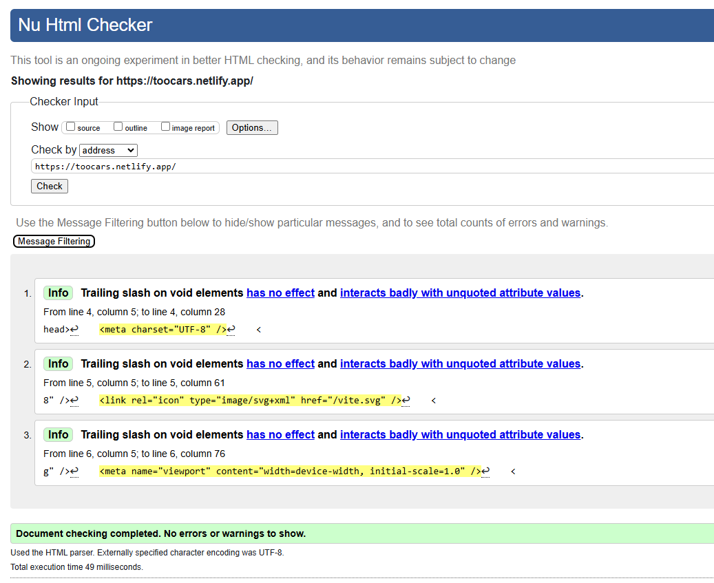

# Too Cars

Este proyecto es una aplicación desarrollada en **React**, que utiliza **BEM** para la organización de los estilos CSS y **SASS** como preprocesador. El proyecto consiste en una página de coches donde poder ver mas coches y aprender .

## Tecnologías Utilizadas

- **React**: Utilizado para crear la interfaz de usuario y los componentes reutilizables. React permite crear una arquitectura de componentes donde cada parte de la interfaz se maneja de forma independiente y eficiente.
  
- **BEM**: La metodología **BEM** se utilizó para estructurar los nombres de las clases de CSS, lo que facilita el mantenimiento, escalabilidad y la reutilización de los estilos. BEM ayuda a evitar conflictos entre las clases de CSS y a mantener un código limpio y organizado.
  
- **SASS**: Se utilizó **SASS** como preprocesador CSS para aprovechar características como variables, anidamiento de selectores, mixins y más, permitiendo una mayor modularidad y facilidad de mantenimiento en los estilos del proyecto.

## Características del Proyecto

- **Animaciones en CSS**: La página cuenta con animaciones suaves utilizando `keyframes` de CSS, lo que permite que el título de error, el mensaje y la imagen del coche se muevan y cambien de forma dinámica.
  
- **Modo Oscuro y Claro**: Se implementó un modo oscuro y claro que se puede alternar, cambiando los colores de fondo, texto y botones para adaptarse a las preferencias del usuario.
  
- **Uso de Variables SASS**: Se ha utilizado **SASS** para definir **variables** que facilitan la personalización y mantenimiento de los estilos. Algunas de las variables definidas incluyen:
  - Colores (primarios, secundarios, de fondo, etc.)
  - Tamaños de fuente
  - Bordes, radios y sombras para un diseño más uniforme y flexible.
  
- **Estructura Modular de Estilos**: Los estilos se organizan en módulos usando la metodología **BEM**, lo que permite una escritura de CSS más clara y escalable. Los nombres de clases son específicos y estructurados para evitar conflictos y facilitar la reutilización.

## Problemas Encontrados y Soluciones

Aquí podrás detallar los problemas que encontraste durante el desarrollo y las soluciones que implementaste.

### El footer
   - **Descripción**: El mayor problema que he tenido es el footer se me quedaba por medio de la pantalla y en muchas páginas no he podido ponerlo bien.
   - **Solución**: He cambiado mucas páginas y actualmente la mayoria esta bien.

### Tipografia
   - **Descripción**: A la hora de subir la app, la página no ha obtenido bien la tipografia del proyecto y tiene otra difirente.


## Estructura
```
src/
├── styles/
│   ├── main.scss
│   ├── base/
│   ├── components/
│   │   ├── _card.scss
│   │   ├── _Footer.scss
│   │   ├── _Navbar.scss
│   │   ├── _Notification.scss
│   │   ├── _PrivateNavbar.scss
│   ├── css/
│   ├── layout/
│   │   ├── _grid.scss
│   │   ├── _navigation.sass
│   ├── pages/
│   │   ├── Auth.scss
│   │   ├── Coche.scss
│   │   ├── Contacto.scss
│   │   ├── error404.scss
│   │   ├── inicio.scss
│   │   ├── menu.scss
│   │   ├── UserSettings.scss
│   └── utilities/
│       ├── _themes.scss
│       ├── _variables.scss

```

## Validaciones
En el video no me he acorado de exponer las validaciones pero han sido hechas.


Tambien las validaciones de CSS


## Video Demo

Aquí puedes agregar un enlace a un video donde se muestre cómo funciona el proyecto o una demostración de la aplicación en acción:

- [Ver video demo](URL_DEL_VIDEO)
- [Despliegue](https://toocars.netlify.app/)
- [Despliegue 2](https://rad-semolina-0aebe9.netlify.app/) Por si acaso falla el primero


